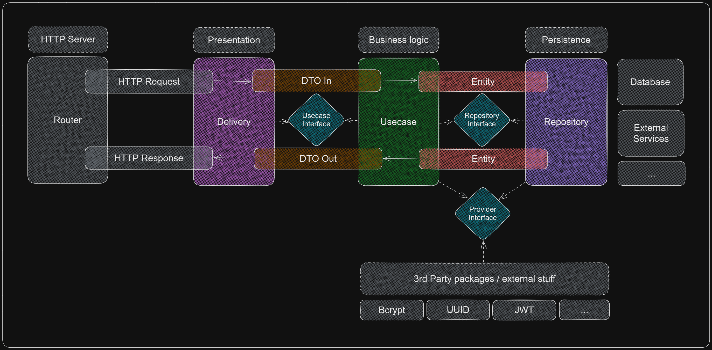

# TaskIt

📑 Task / Todo management

## API Documentations

See the [Postman documenter](https://documenter.getpostman.com/view/20528220/2s8YzUwgb4) for API documentations.

## Architecture

Implement [clean architecture](https://blog.cleancoder.com/uncle-bob/2012/08/13/the-clean-architecture.html) by Robert C. Martin (Uncle Bob)

## License

MIT licensed. See the [LICENSE](./LICENSE) file for details.
